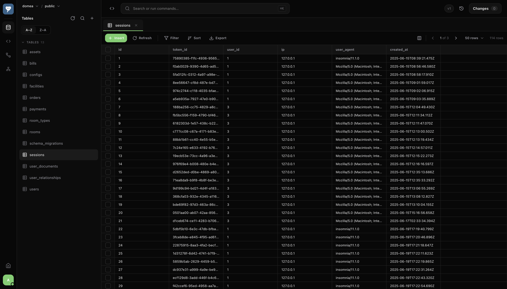
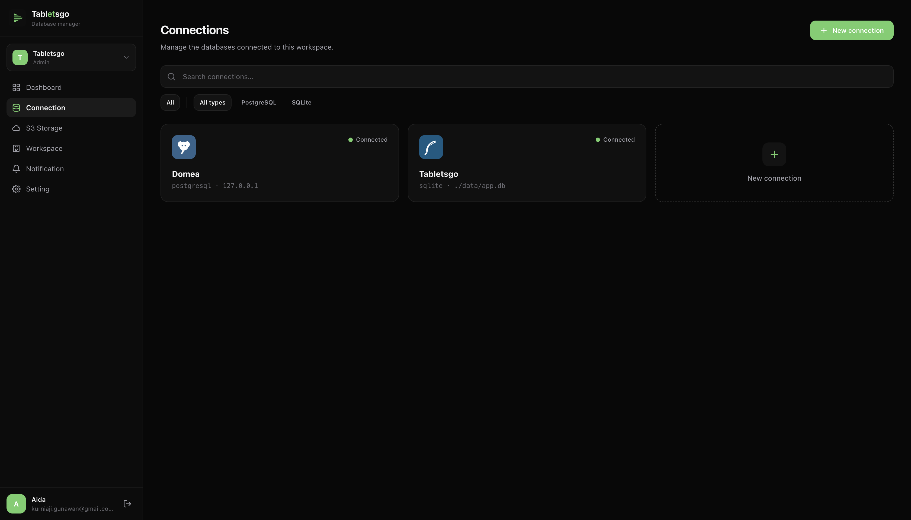
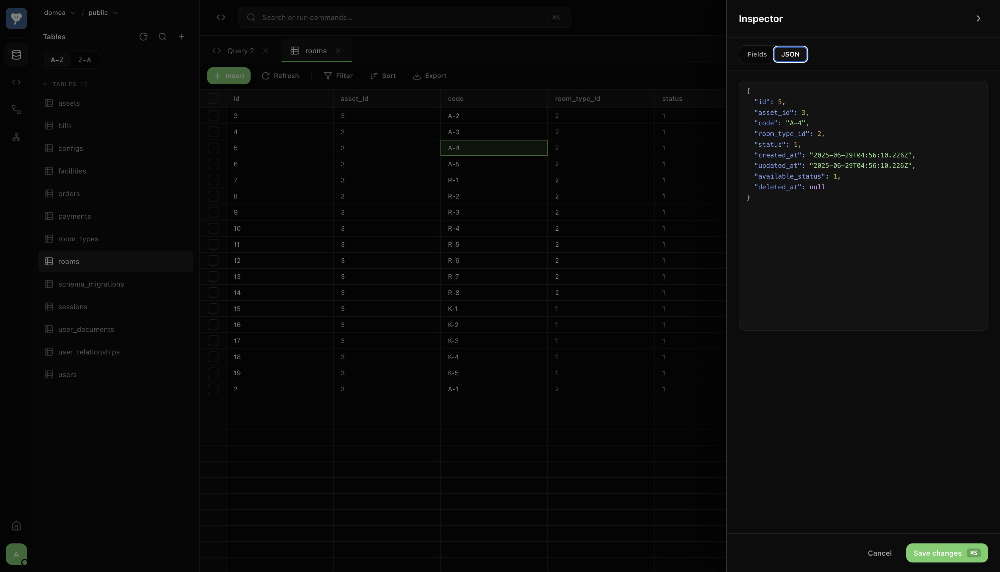
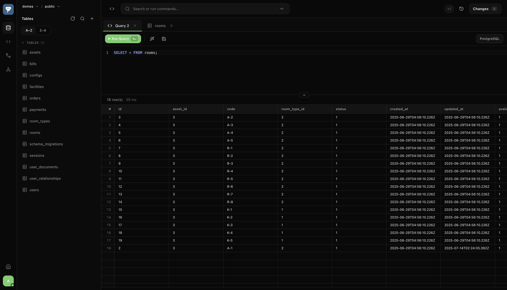
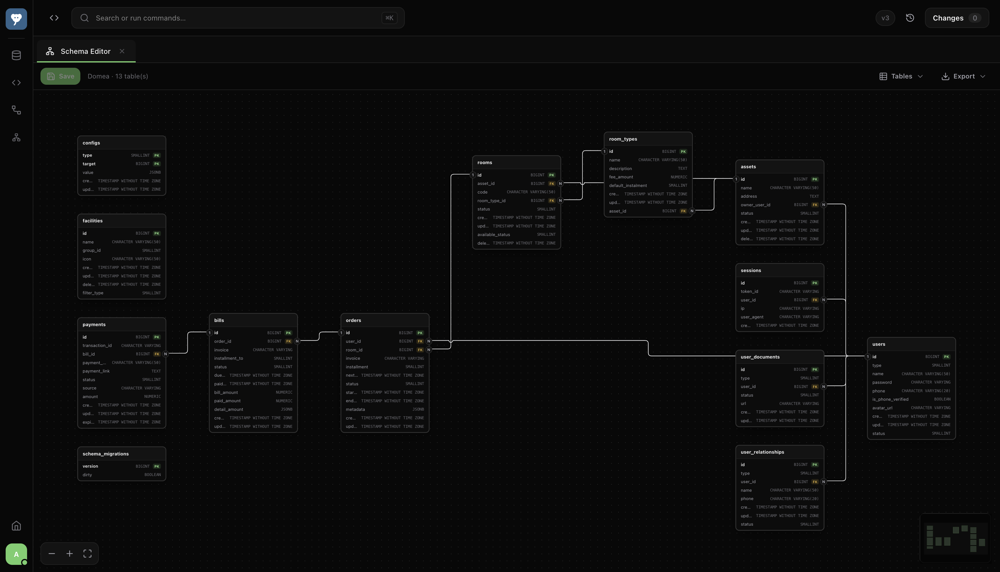
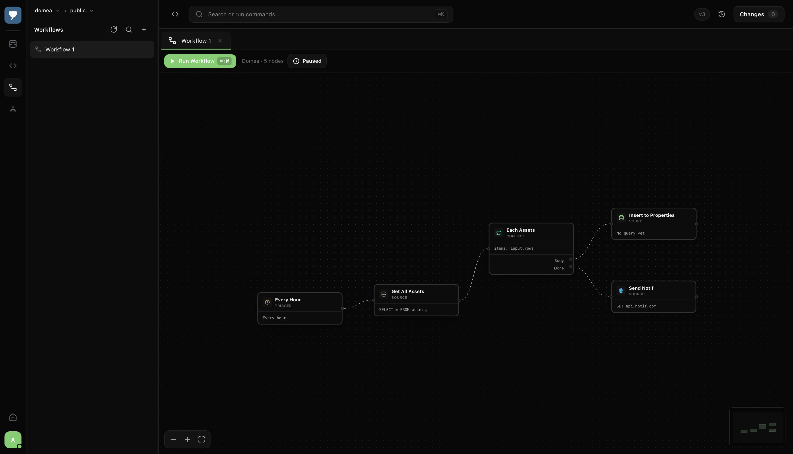
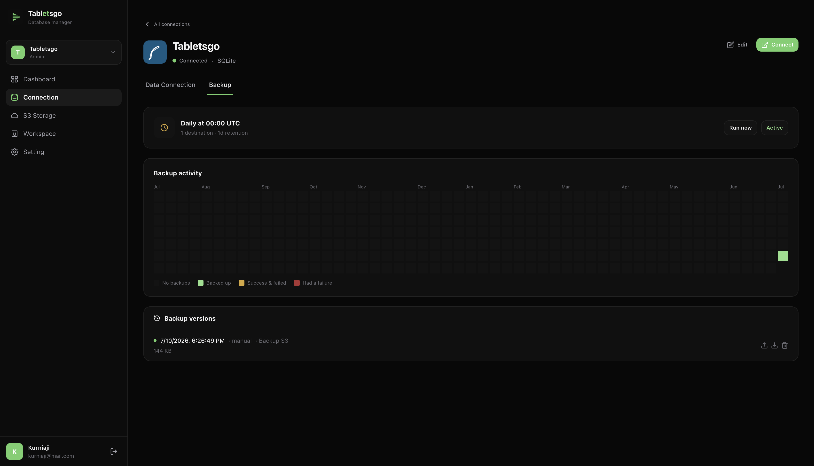

<div align="center">


# Tabletsgo

**A self‑hosted, team‑friendly database console.**
Browse data, write queries, design schemas visually, automate workflows, and back up to S3 — all from one clean, keyboard‑friendly web app you run yourself.

[](package.json)
[](#-installation)
[](https://react.dev)
[](https://www.typescriptlang.org)

</div>

<p align="center">
  
</p>

---

## Introduction

**Tabletsgo** is an open, self‑hosted database management platform for teams. Think of it as a modern web console that lives next to your databases: connect to a Postgres or SQLite instance, explore and edit rows in a fast data grid, run and save SQL, and design your schema on a visual ERD — without leaving the browser.

It's built for **teams**, not just a single power user. Everything is organized into **workspaces** with per‑workspace members and roles, so you can share a set of connections with your team, invite people by email, and keep environments (dev / staging / prod) tidy in one place.

What makes Tabletsgo more than a query tool:

- 🎨 **Visual schema designer** — model tables and relationships on a React Flow canvas, then stage the DDL as reviewable changes.
- ⚙️ **Workflow automations** — chain nodes (schedule/webhook → query → HTTP → JavaScript → export) to automate recurring database tasks, triggered on a schedule or by an inbound webhook.
- 💾 **Scheduled backups to S3** — point a connection at any S3‑compatible bucket and let it export & upload on a schedule, with a calendar heatmap of runs and one‑click restore.
- 🔐 **Credentials encrypted at rest** — connection secrets are stored AES‑256‑GCM encrypted; the server refuses to boot without an encryption key.

Self‑hosted, single Docker image, your data stays yours.

---

## Features

| | Feature | What it does |
|---|---|---|
| 🗂️ | **Connections** | Organize databases by environment, folder, and tags. Credentials encrypted at rest. Per‑connection access control. |
| 📊 | **Data browser** | Fast, spreadsheet‑style data grid — filter, multi‑column sort (click a header, Shift+click to add), edit rows inline, insert & delete, with a staged **Changes** panel before you commit. |
| 🧮 | **SQL editor** | CodeMirror‑powered editor with SQL highlighting, formatting, query history, and reusable **saved queries**. |
| 🎨 | **Schema designer** | Visual ERD (React Flow) to create/edit tables and columns; staged DDL with a **schema version** audit trail and best‑effort rollback SQL. |
| ⚙️ | **Workflows** | Drag‑and‑drop automation builder: `Manual`/`Schedule`/`Webhook` triggers → `Run query`, `HTTP Request`, `Run JavaScript`, `Switch`, `Loop`, `Export SQL`, `Store to Storage`. Real hourly/daily scheduling, a public **webhook** trigger URL, **folders** to organize them (drag into nested folders), JSON export/import (share or version‑control a workflow's graph — webhook tokens are stripped on export and re‑minted on import), and an **Activity** trail of past runs (every trigger). The JavaScript node has a built‑in `crypto` helper for HMAC/hash signing (e.g. signed HTTP headers). Runs can carry an input payload; query nodes inline it as `{{input.field}}`. |
| 📈 | **Dashboards** | Per‑connection query dashboards with dynamic `{{variables}}` (single‑ or **multi‑select** with "select all" — multi values expand to a SQL list for `IN (…)`, shown as glanceable filter chips), drag/resize grid, JSON export/import, **auto‑refresh** (10s–5m with a "last updated" indicator) and a fullscreen **kiosk mode** (auto‑hiding toolbar for wall displays). Table widgets support server‑side pagination and per‑row **action buttons** that run a workflow with the clicked row as its input. |
| 🧩 | **Templates** | Browse built‑in dashboard/workflow templates, filtered by database type, and apply one with a click to instantly create the bundled dashboard(s) and workflow(s) on your connection — e.g. a PostgreSQL health dashboard wired to a one‑click **Vacuum** workflow. |
| 💾 | **Backups & restore** | S3‑compatible storage destinations + per‑connection scheduled backups. Calendar heatmap of runs and point‑in‑time restore — from a tracked backup version, any file browsed out of a storage destination, or a backup file uploaded from your computer. |
| 👥 | **Workspaces & teams** | Multi‑workspace (org/tenant) model with members, teams, and `admin`/`member` roles. Email invites (SMTP optional — always get a copyable link). |
| 🔑 | **Auth & security** | First‑run setup wizard, token‑based auth, per‑workspace roles, and membership‑guarded connection routes. |
| ⬆️ | **In‑app updates** | Checks GitHub for newer releases and guides admins through a safe update — backup → pre‑flight checks → apply → verify. One‑click self‑update when the Docker socket is mounted, otherwise a copyable `docker compose pull` command. |
| ⌨️ | **Keyboard‑first** | Configurable keymap and shortcuts throughout the console. |
| 🌗 | **Theming** | Light / dark theme, clean and distraction‑free. |

---

## Screenshots

<table>
  <tr>
    <td width="50%">
      
      <p align="center"><sub><b>Connections</b> — filter by environment, folder & tags</sub></p>
    </td>
    <td width="50%">
      
      <p align="center"><sub><b>Data browser</b> — edit rows inline, stage changes</sub></p>
    </td>
  </tr>
  <tr>
    <td width="50%">
      
      <p align="center"><sub><b>SQL editor</b> — history & saved queries</sub></p>
    </td>
    <td width="50%">
      
      <p align="center"><sub><b>Schema designer</b> — visual ERD, staged DDL</sub></p>
    </td>
  </tr>
  <tr>
    <td width="50%">
      
      <p align="center"><sub><b>Workflows</b> — drag-and-drop automation builder</sub></p>
    </td>
    <td width="50%">
      
      <p align="center"><sub><b>Backups</b> — scheduled runs & calendar heatmap</sub></p>
    </td>
  </tr>
</table>


---

## Database compatibility

Tabletsgo speaks a **dialect‑agnostic** connection contract, so support grows without breaking the API.

| Database | Status |
|---|:---:|
| **PostgreSQL** | ✅ Supported |
| **SQLite** | ✅ Supported |
| MySQL | 🚧 Planned |
| MariaDB | 🚧 Planned |
| MongoDB | 🚧 Planned |
| Redis | 🚧 Planned |

---

## Try it in 60 seconds

The fastest way to kick the tires — one command, no external database required. Tabletsgo ships as a single Docker image with a built‑in SQLite metadata store, so there's nothing else to install.

```bash
git clone https://github.com/aidapedia/tabletsgo.git
cd tabletsgo

# 1. Create your env (generates a required encryption key)
cp .env.example .env
node -e "console.log('ENCRYPTION_KEY='+require('crypto').randomBytes(32).toString('hex'))" >> .env

# 2. Run it
docker compose up -d
```

Open **http://localhost:3000**, complete the quick **first‑run setup wizard** (create your admin + workspace), add your first connection, and start browsing. 🎉

---

## Configuration

All configuration is via environment variables (see [`.env.example`](.env.example)):

| Variable | Required | Description |
|---|:---:|---|
| `ENCRYPTION_KEY` | ✅ | AES‑256‑GCM key encrypting connection credentials at rest. The server won't start without it. **Changing/losing it makes existing credentials unreadable.** |
| `PORT` | | Host port to expose (container listens on `3000`). |
| `META_DB` | | Path to the metadata SQLite DB (default `/app/data/app.db`). |
| `ADMIN_USERNAME` / `ADMIN_PASSWORD` / `WORKSPACE_NAME` | | Optional admin pre‑seed. Leave unset to use the in‑browser setup wizard. |
| `SMTP_HOST` / `SMTP_PORT` / `SMTP_USER` / `SMTP_PASS` / `SMTP_FROM` / `SMTP_SECURE` | | Optional SMTP for invite emails (per‑workspace UI settings override these). Invites always return a copyable link even without SMTP. |
| `VITE_API_URL` | | Frontend API base, **baked at build time** (default `/api`). Set to an absolute URL only for a split frontend/backend deploy. |
| `WORKFLOW_SCHEDULER_ENABLED` | | Set `false` to disable the minutely cron tick (useful for local/CI). |
| `TABLETSGO_TAG` | | Published image tag `docker compose` runs and pulls on self‑update (default `latest`). One‑click self‑update works best on a moving tag. |
| `UPDATE_IMAGE` / `UPDATE_REPO` / `UPDATE_HELPER_IMAGE` | | In‑app update checker — default to the official image/repo; override only for a fork. Mount the Docker socket (see `docker-compose.yml`) to enable one‑click self‑update via `UPDATE_HELPER_IMAGE` (default `docker:cli`); otherwise the wizard shows a manual pull command. |

---

## Donation

To stay completely free and open-source, with no feature behind the paywall and evolve the project, we need your help. If you like Tabletsgo, please consider donating to help us fund the project's future development.

---

## License

This project is licensed under the [Apache License 2.0](LICENSE).

<div align="center">
<sub>Built with ☕ and SQL. Self‑host it, own your data.</sub>
</div>
