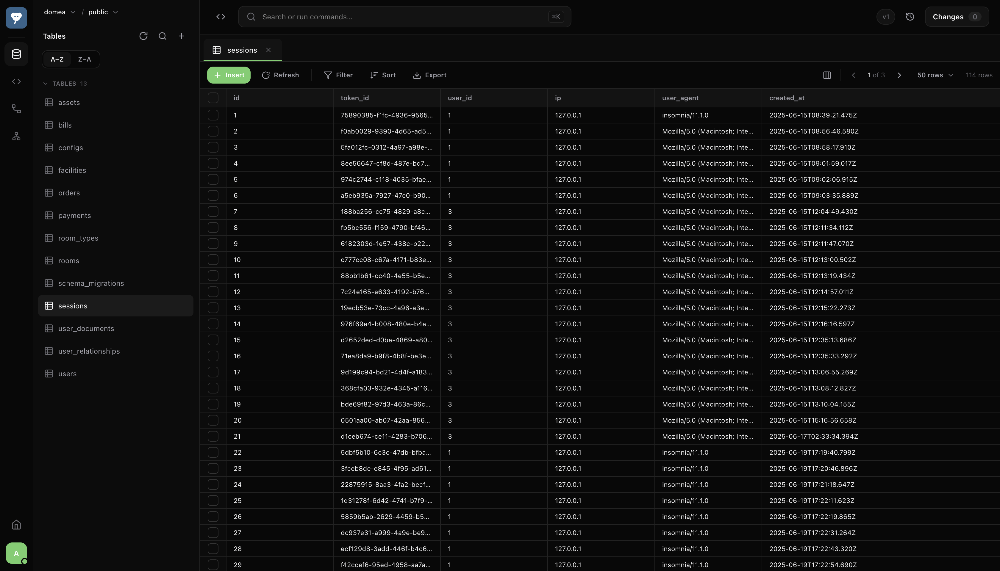
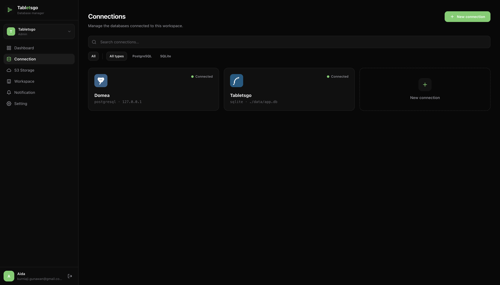
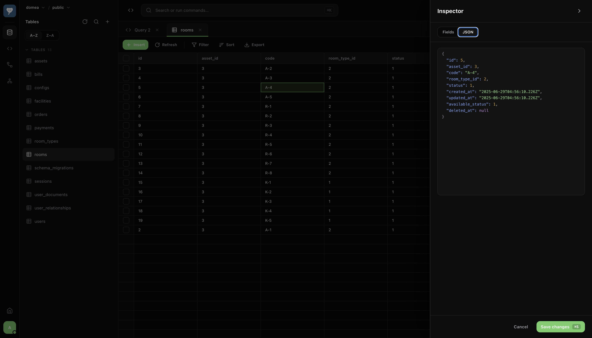
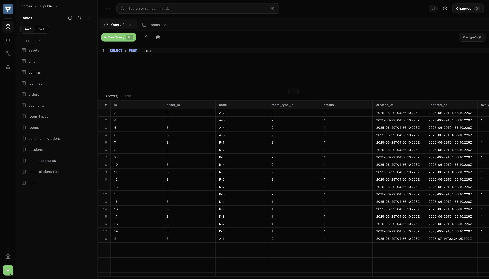
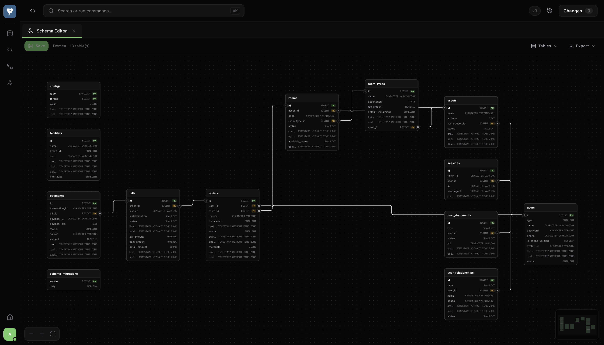
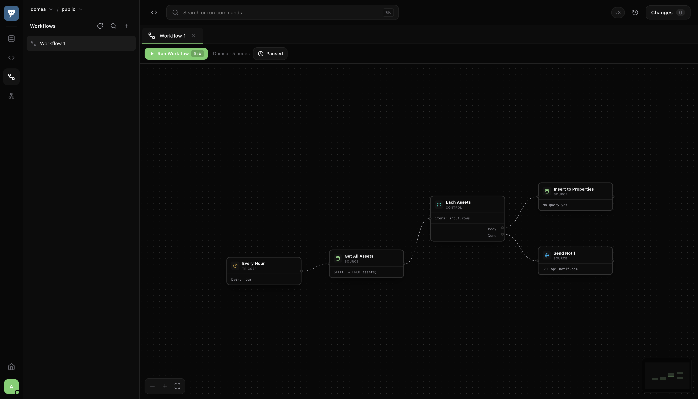
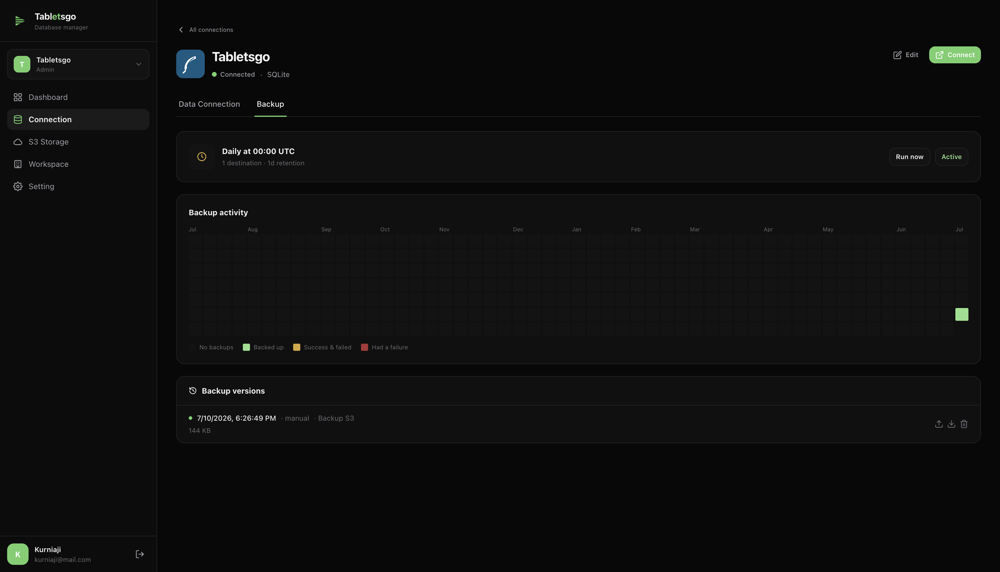

<div align="center">


# Tabletsgo

**A self‑hosted, team‑friendly database console.**
Browse data, write queries, design schemas, automate workflows and back up to S3 — from one web app you run yourself.

[](package.json)
[](#-installation)
[](https://react.dev)
[](https://www.typescriptlang.org)

</div>

<p align="center">
  
</p>

## Features

- **Data browser** — spreadsheet‑style grid: filter, sort, edit inline, review staged changes before commit.
- **SQL editor** — highlighting, formatting, history and saved queries.
- **Schema designer** — visual ERD; stage DDL, release it in one confirmed step, roll back by version.
- **Workflows** — schedule/webhook triggers → query → HTTP → JavaScript → export.
- **Dashboards** — query widgets with variables, auto‑refresh and a kiosk mode.
- **Backups** — scheduled dumps to any S3‑compatible bucket, with one‑click restore.
- **Data export / import** — CSV, JSON or SQL, with a dry‑run preview.
- **SSH tunnels** — reach private databases through a bastion (plain SSH, Railway, Cloudflare Access).
- **Teams** — workspaces, groups, email invites and permission‑based roles on a resource tree.
- **Secure by default** — credentials encrypted at rest (AES‑256‑GCM), brute‑force login protection.
- **In‑app updates**, split view, configurable keymap, light/dark theme.

Every feature in detail: **[docs/FEATURES.md](docs/FEATURES.md)**.

<table>
  <tr>
    <td width="33%"><p align="center"><sub>Connections</sub></p></td>
    <td width="33%"><p align="center"><sub>Data browser</sub></p></td>
    <td width="33%"><p align="center"><sub>SQL editor</sub></p></td>
  </tr>
  <tr>
    <td width="33%"><p align="center"><sub>Schema designer</sub></p></td>
    <td width="33%"><p align="center"><sub>Workflows</sub></p></td>
    <td width="33%"><p align="center"><sub>Backups</sub></p></td>
  </tr>
</table>

| Database | Status |
|---|:---:|
| PostgreSQL, SQLite, Redis | ✅ Supported |
| MySQL, MariaDB, MongoDB | 🚧 Planned |

## Quick start

```bash
git clone https://github.com/aidapedia/tabletsgo.git
cd tabletsgo
cp .env.example .env
node -e "console.log('ENCRYPTION_KEY='+require('crypto').randomBytes(32).toString('hex'))" >> .env
docker compose up -d
```

Open **http://localhost:3000** and finish the setup wizard. It creates the **instance admin**, who then creates the first workspace (and names its owner) under **Administration → Workspaces**. The owner adds connections.

> Keep `ENCRYPTION_KEY` safe — losing or changing it makes saved credentials unreadable.

**Upgrading:** `docker compose pull && docker compose up -d`. A one‑shot `migrate` service updates the metadata schema before the app starts.

**PostgreSQL instead of SQLite** for the app's own metadata: set `META_DB_TYPE=postgresql` and `META_DATABASE_URL`, then `docker compose --profile postgresql up -d`. See [docs/CONFIGURATION.md](docs/CONFIGURATION.md#postgresql-for-app-metadata).

## System requirements

**A 1 vCPU / 1 GB RAM server with Docker is enough for a team.**

| | Minimum | Recommended |
|---|---|---|
| CPU | 0.5 vCPU | 1 vCPU |
| RAM | 512 MB | 1 GB |
| Disk | 2 GB | 5 GB + backups |

Tabletsgo itself uses ~150–250 MB of RAM; the rest is for the OS and Docker. More CPU makes it faster; more RAM doesn't. Details: [docs/BENCHMARK.md](docs/BENCHMARK.md).

## Configuration

Set these in `.env`. Everything else is optional.

| Variable | Description |
|---|---|
| `ENCRYPTION_KEY` | **Required.** Encrypts connection credentials at rest. |
| `PORT` | Host port (default `3000`). |
| `META_DB_TYPE` / `META_DATABASE_URL` | Metadata store: `sqlite` (default) or `postgresql` + its URL. |
| `ADMIN_USERNAME` / `ADMIN_PASSWORD` | Pre‑seed the instance admin instead of using the wizard. |
| `SMTP_*` | Fallback mail server for invites and resets (admins can set one in the UI). |

Full list: [docs/CONFIGURATION.md](docs/CONFIGURATION.md) and [`.env.example`](.env.example).

## Development

```bash
npm install
npm run dev:all     # Vite frontend + API server (runs migrations first)
npm test
```

Architecture: [docs/ARCHITECTURE.md](docs/ARCHITECTURE.md) · API: [BACKEND_DOCUMENTATION.MD](BACKEND_DOCUMENTATION.MD) · Contributing: [CONTRIBUTING.md](CONTRIBUTING.md)

## Donation

Tabletsgo is free and open source with nothing behind a paywall. If it helps you, please consider donating to fund its development.

## License

[Apache License 2.0](LICENSE)
